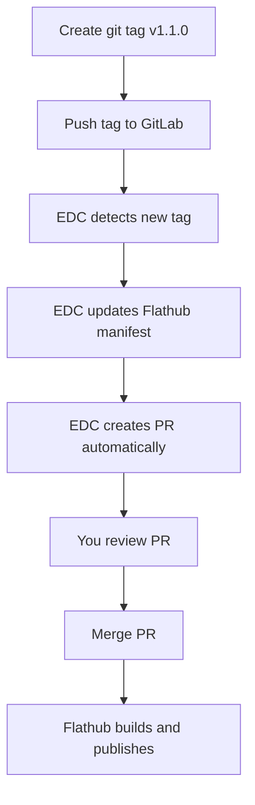

# Flathub Branching Strategy for TowDow

## 🎯 **Recommended Approach: Automated Updates (No Manual Branching)**

### **Why Use EDC (External Data Checker)?**

Once your app is published on Flathub, the **best practice** is to set up automated updates:

```bash
# Setup once, then forget about manual updates
./setup_automated_updates.sh /path/to/flathub/repo
```

### **How It Works:**

1. **You create a git tag** in your TowDow repository:
   ```bash
   git tag v1.1.0
   git push origin v1.1.0
   ```

2. **EDC automatically detects** the new tag

3. **EDC updates the main branch** in your Flathub fork automatically

4. **EDC creates a PR** for you to review

5. **You just review and merge** the PR

### **What You Don't Need to Do:**
- ❌ Create branches manually
- ❌ Update manifests manually  
- ❌ Update version numbers manually
- ❌ Create PRs manually

## 🔄 **Update Workflow with EDC**



## 📋 **Manual Updates (Alternative)**

If you prefer manual control or EDC isn't working:

### **Branch Strategy:**
```bash
# Option A: New branch per update
update-to-1.1.0  # ← Create this for v1.1.0
update-to-1.2.0  # ← Create this for v1.2.0

# Option B: Single update branch (reuse)
update-towdow    # ← Reuse this branch for all updates
```

### **Manual Process:**
```bash
# Use the update script
./update_flathub.sh /path/to/flathub/repo 1.0.0 1.1.0
```

## 🎯 **My Recommendation**

### **For TowDow, use EDC because:**

1. **Less work**: You just create git tags
2. **Faster updates**: No manual PR creation
3. **Fewer errors**: Automated manifest updates
4. **Standard practice**: Most Flathub apps use EDC
5. **Reliable**: EDC is maintained by Flathub team

### **Setup Steps:**

1. **Initial setup** (one time):
   ```bash
   ./setup_automated_updates.sh /path/to/flathub/repo
   ```

2. **For each update** (repeated):
   ```bash
   # In your TowDow repository
   git tag v1.1.0
   git push origin v1.1.0
   # That's it! EDC handles the rest
   ```

## 🔍 **When to Use Manual Updates**

Use manual updates only if:
- EDC is not working properly
- You need custom changes to the manifest
- You're doing major architectural changes
- You want to add/remove dependencies

## 📝 **Summary**

**Recommended workflow:**
1. ✅ Setup EDC once
2. ✅ Create git tags for new versions
3. ✅ Let EDC handle Flathub updates automatically
4. ✅ Review and merge EDC-generated PRs

**No manual branching needed** with EDC! 🎉
